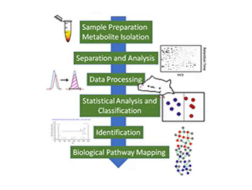

**Metabolomics analysis tools**

*Tool development for bioinf576 class*

The goal of this project is to implement a Python based pipeline or package related to metabolomics data analysis. I am currently working with targeted metabolomics data in my lab, and it will be helpful with my work to develop a package that contains some very common metabolomics data analysis tools, including data quality check, data transformation/normalization/scaling, and statistical analyses that contains PCA and MA plot. Even though there are lots of packages available for the functions mentioned above, implementing them myself will help me understand those functions better and help me do a better analysis job hopefully.  

